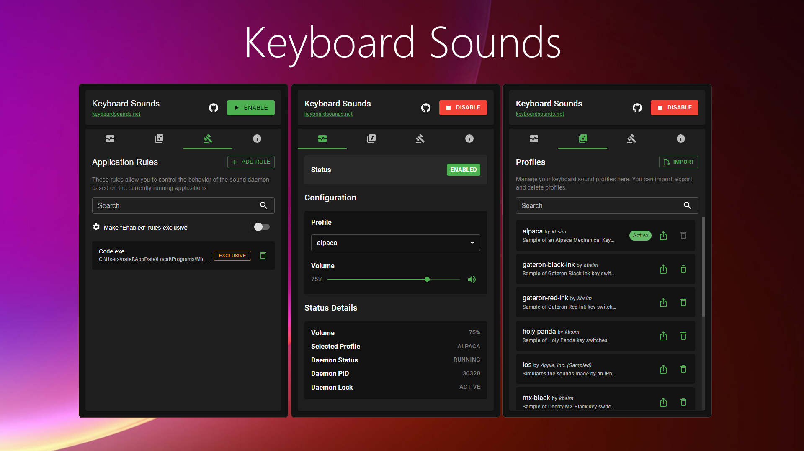

<p align="center">
  
  <h1 align="center">Keyboard Sounds</h1>
  <p align="center">Add sound effects to your typing experience.</p>
</p>

<div align="center">

<a href="https://github.com/sponsors/nathan-fiscaletti"></a>
<a href="https://badge.fury.io/py/keyboardsounds"></a>
<a href="https://github.com/nathan-fiscaletti/keyboardsounds/blob/master/LICENSE"></a>
<a href="https://pepy.tech/project/keyboardsounds"></a>

</div>

<p align="center">
Keyboard Sounds is a tool that runs in your system tray and plays sound effects when you type on your keyboard. It comes with a variety of sound profiles to choose from, and you can even create your own custom profiles.
</p>

<p align="center">

  

</p>

### Getting Started

- [Install Keyboard Sounds](#installation)
- [Create Custom Profiles](#custom-profiles)
- [Command Line Usage](#command-line)

### Helpful Links

- [Uninstall Keyboard Sounds](#uninstalling)
- [Developer Documentation](#development)

## Installation

Keyboard Sounds can be installed as a desktop application or as a Python package. The desktop application is recommended for most users as it is easier to install and use.

### Desktop Application

[⬇️ Download (Windows Only)](https://github.com/nathan-fiscaletti/keyboardsounds/releases/latest)

Currently the desktop application is only available for **Windows**. The Python package can be used on any platform that supports Python.

The desktop application still requires the Python package to be installed on your system. On first launch, the application will check that both Python and the required Python packages are installed.

  - Make sure when you install Python that you check the box that says **"Add Python to PATH"**. This will allow you to run Python from the command line, which is a requirement for the desktop application to function correctly.

You may need to restart the application after doing this for the changes to take effect.

### Python Package

To install this application as a CLI utility via the Python package, you will need to have Python installed on your system. You can download Python from the [official website](https://www.python.org/).

  - Make sure when you install Python that you check the box that says **"Add Python to PATH"**. This will allow you to run Python from the command line.
  - After you have installed Python, you can install the Keyboard Sounds CLI by running the following command in your terminal.

    ```sh
    $ pip install keyboardsounds
    ```

## Custom Profiles

This application supports custom profiles in which you can provide your own WAV or MP3 files to be used for the different keys pressed.

Read more about creating and editing profiles [here](./docs/custom-profiles.md).

## Command Line

Keyboard Sounds has a comprehensive backend that can be used to manage the daemon, application rules, and profiles. This backend can be accessed via the command line interface (CLI) in your terminal application.

Read more about backend usage [here](./docs/backend.md).

## Uninstalling

You can uninstall the Keyboard Sounds Desktop Application from the "Apps" section of your system Settings application. 

- Uninstalling the desktop app will **not** remove the Python package from your system, you will need to do this manually if you no longer wish to use the Python package using the following command:

  ```sh
  $ pip uninstall keyboardsounds
  ```

## Development

Documentation for developers who wish to contribute to this project can be found [here](./docs/development.md).
