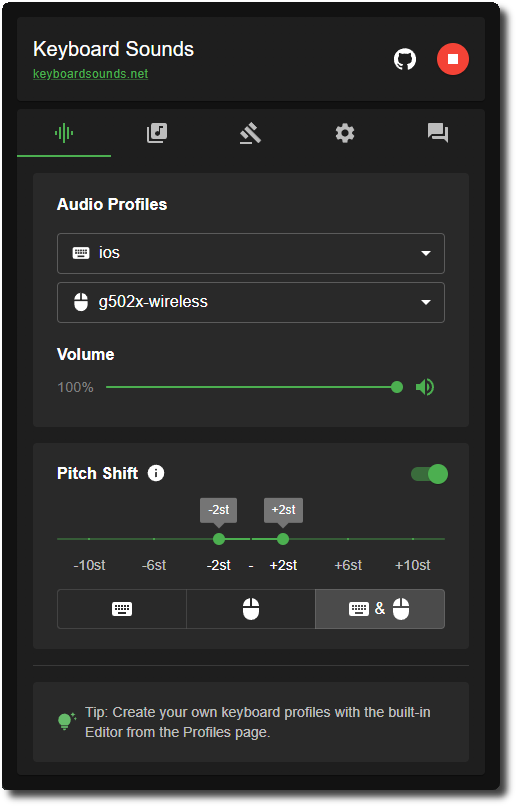
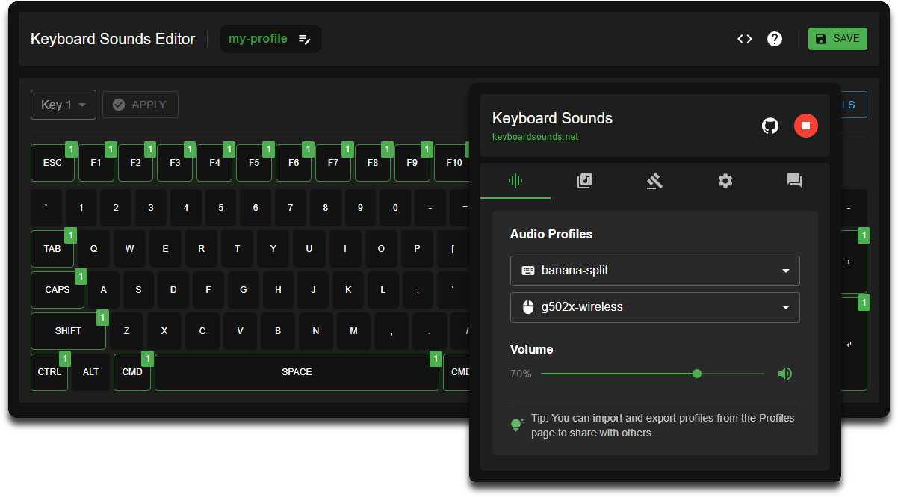
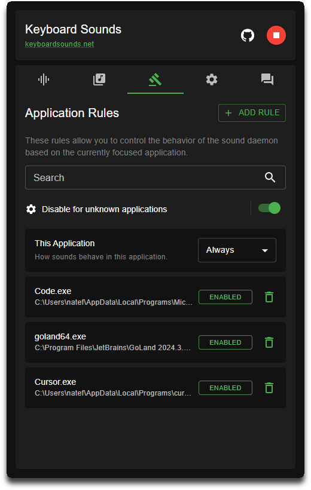
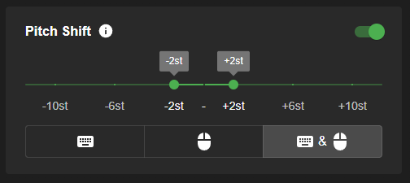

https://github.com/user-attachments/assets/e2ed8513-0241-46ce-8a24-43104580d511

# Keyboard Sounds

[](https://discord.gg/gysskqts6z)
[](https://github.com/sponsors/nathan-fiscaletti)
[](https://badge.fury.io/py/keyboardsounds)
[](https://github.com/nathan-fiscaletti/keyboardsounds/blob/master/LICENSE)

Keyboard Sounds is a free application that makes any keyboard sound like a Mechanical Keyboard. It includes 16 built in profiles, a profile editor, and application rules.



<br>

<a href="https://github.com/nathan-fiscaletti/keyboardsounds/releases/latest"></a>

### Getting Started

- [Create Custom Profiles](#custom-profiles)
- [Application Rules](#application-rules)
- [Randomized Pitch Shift](#randomized-pitch-shift)
- [Using Keyboard Sounds with OBS](#using-keyboard-sounds-with-obs)
- [Command Line Usage](#command-line-macos-linux-or-windows)

### Helpful Links

- [Uninstall Keyboard Sounds](#uninstalling)
- [Linux Support](./docs/linux-support.md)
- [Developer Documentation](#development)

<br><br>

> [!NOTE]\
> The desktop application is only available for **Windows** and **Linux([*](./docs/linux-support.md))**. 
>
> * The [command line application](#command-line-macos-linux-or-windows) can be used on any platform that supports Python.


## Features

### Custom Profiles

- Support for both **Mouse** and **Keyboard** audio profiles
- Comes bundled with sixteen built in profiles (16 keyboard, 1 mouse)
- Supports Custom profiles through the editors (`.wav` and `.mp3` supported)

Read more about creating and editing profiles [here](./docs/custom-profiles.md).



<br>

### Application Rules



- Keyboard Sounds supports application rules in which you can control the behavior of the sound daemon based on the currently focused application.

- This allows you to do things like only enabling in your text editor or terminal, disabling it for specific games, or localizing the sound effects to a particular application.

- Read more about application rules [here](./docs/app-rules.md).

- _Application rules are currently only available for the Windows platform._

<br><br><br><br><br><br><br><br><br><br>

### Randomized Pitch Shift



Keyboard Sounds supports randomized pitch shifting in which you can change the pitch of the sound effects to a random value between a lower and upper bound.

When enabled, each time a key is pressed or a mouse click is made, the pitch of the sound effect will be randomized between the lower and upper bound.

<br><br><br><br>

## Using Keyboard Sounds with OBS


In order to use Keyboard Sounds with OBS as an isolated audio source, OBS needs a window that it can attach to that's connected to the process running the Daemon. _This is not the same process as the desktop application._ To work with this, Keyboard Sounds provides a window that can be enabled for the audio daemon.

To enable this window you have several options:

1. **If you ALWAYS want the daemon window**: In the **Settings** tab of the Keyboard Sounds Desktop Application, check the "Enable Daemon Window" option. This will start the daemon window each time that the sound daemon is started by the desktop application.
2. **If you only want the daemon window on demand**: You can opposite click the Keyboard Sounds tray icon in your system tray and select the "Show Daemon Window" option. This will only work when the daemon is currently running.
3. **If you are using the command line**: Run your `kbs start` command with the `-w` flag.

> [!NOTE]\
> On linux, you will need to run `sudo apt install python3-tk` in order to use the `-w` flag with `kbs start`.

<br><br>

## Command Line (macOS, Linux or Windows)

1. **Install Python**
   
   To install this application as a CLI utility via the Python package, you will need to have Python installed on your system. You can download Python from the [official website](https://www.python.org/).

> [!IMPORTANT]\
> **Make sure when you install Python that you check the box that says "Add Python to PATH"**.
> This will allow you to run Python from the command line, which is a requirement for the application to function correctly.

2. **Install the Keyboard Sounds CLI**

   After you have installed Python, you can install the Keyboard Sounds CLI by running the following command in your terminal.

   ```sh
   $ pip install keyboardsounds
   ```
3. **Using the CLI**
   
   To use the Keyboard Sounds CLI, run `kbs --help` from your command line terminal.

<br><br>

## Uninstalling

### Desktop Application

You can uninstall the Keyboard Sounds Desktop Application from the "Apps" section of your system Settings application.

### Command Line Application

```sh
$ pip uninstall keyboardsounds
```

## Development

Documentation for developers who wish to contribute to this project can be found [here](./docs/development.md).

If you have any questions, feel free to  [DM me on Discord](https://discord.gg/gysskqts6z).

                        
## Stargazers over time

[](https://starchart.cc/nathan-fiscaletti/keyboardsounds)
