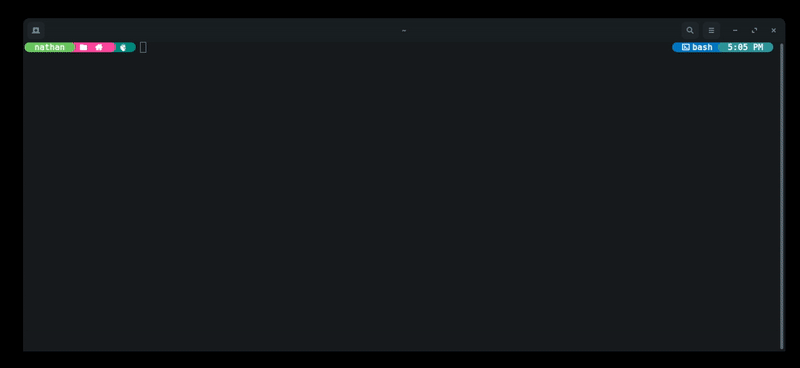

# iOS Typing Sound

[](https://github.com/sponsors/nathan-fiscaletti)
[](https://badge.fury.io/py/iostypingsound)
[](https://github.com/nathan-fiscaletti/iostypingsound/blob/master/LICENSE)

This python package will add the iOS Keyboard Typing Sound to your system so that any time you type anywhere on your system, it will sound like an iOS keyboard.

## Demo

> The preview is somewhat pointless without audio. You can click the preview to download the original video and watch it with audio enabled.

[](./preview.mov?raw=true)

## Installation

> Note: `ffmpeg` must be available on your path for this application to function. Click [here](https://ffmpeg.org/download.html) for more information.

```sh
$ pip install iostypingsound
```

## Usage

Start the daemon

```sh
$ iostype start
```

Check the status of the daemon

```sh
$ iostype status
```

Stop the daemon

```sh
$ iostype stop
```
