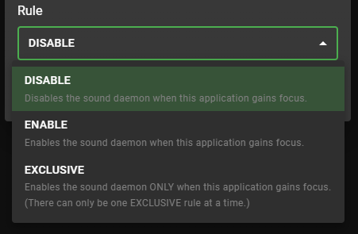
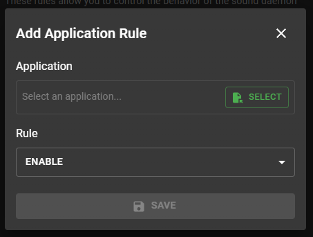

# Keyboard Sounds: Application Rules


**⚠️ Application Rules are only available on Windows**

## Index

- [Rule Types](#rule-types)
- [Add and Remove Rules](#add-and-remove-rules)
- [Set the global rule](#set-the-global-rule)

## Rule Types



- `enable` - Enable sound effects for the application.
- `disable` - Disable sound effects for the application.
- `exclusive` - Only play sound effects for the application.

> The global rule can only be set to `enable` or `disable`. By default, the global rule is set to `enable`.

## Add and Remove Rules

### In Application

You can add and remove rules in the Application Rules section of the application.



### From the Command Line

```bash
# Add a rule to disable sound effects for an application
$ kbs add-rule -r disable -a "C:\Program Files\MyApp\MyApp.exe" 

# Remove a rule for an application
$ kbs remove-rule -a "C:\Program Files\MyApp\MyApp.exe"
```

## List Rules

```bash
# List the currently loaded rules
$ kbs list-rules
```

## Set the global rule

> The global rule is used as the fallback for any application that does not have a specific rule set. By default, it is set to `enable`.

```bash
# Set the global rule to disable
$ kbs set-global-rule -r disable

# Retrieve the current global rule
$ kbs get-global-rule
```