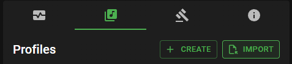
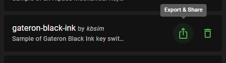
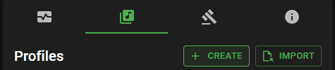

# Keyboard Sounds: Custom Profiles

Keyboard Sounds comes bundled with eleven built-in sound profiles and supports custom profiles in which you can provide your own WAV or MP3 files to be used for the different keys pressed.


## Index

- [Sharing your profile](#sharing-your-profile)
- [Importing a profile](#importing-a-profile)
- [Exporting an existing profile](#exporting-an-existing-profile)
- [Creating a new Profile](#creating-a-new-profile)
- [Editing a Profile](#editing-a-profile)
- [Compiling a Profile](#compiling-a-profile)

## Sharing your profile

If you have created a profile that you think others would enjoy, you can share it with the community on the Discord Server in the `#profiles` channel.

[](https://discord.gg/gysskqts6z)

## Importing a profile

### In Application

To import a profile in the application, use the "Import" button in the Profiles section.



### From the Command Line

Profiles can be imported from a ZIP file using the `add-profile` action.

```bash
$ kbs add-profile -z "./my-profile.zip"
```

## Exporting an existing profile

### In Application

To export a profile in the application, use the "Export" button in the Profiles section.



### From the Command Line

Profiles can be exported from the command line using the `export-profile` action.

```bash
$ kbs export-profile -n my-profile -o "./my-profile.zip"
```

## Creating a new Profile

### Using the Editor

To create a new profile using the editor, use the "Create" button in the Profiles section of the application.



### From the Command Line

Create a new profile using the following command:

```bash
$ kbs new -n "My Profile"
```

This will create a new directory called `my-profile` using the [example profile](../keyboardsounds/profiles/profile.template.yaml).

> You can optionally customize the directory path by providing the `-d` argument. If this is not provided, a new directory will be created for you in the current working directory.
>
> ```bash
> $ kbs new -n "My Profile" -d "./my-profile"
> ```

Alternatively, you can use the interactive builder to add sources, keys, and default key mappings directly to a new profile before saving it. 

```bash
$ kbs bp -d "./my-profile"
```

## Editing a Profile

- Edit the profile.yaml file to customize the profile.
- Add sound files to the directory.

Alternatively, you can use the interactive builder to add sources, keys, and default key mappings.

```bash
$ kbs bp -d "./my-profile"
```

## Compiling a Profile

- **Using the interactive builder**

  If you are using the interactive builder, you can build the profile using the `save` command. When using the save command, if the interactive builder was opened using an existing profile, you do not need to provide an output file. However, if you are creating a new profile, you must provide an output file.

  ```bash
  save output-file.zip
  ```

- **Manually**
  
  If you are not using the interactive builder, you can build a profile from an existing directory using the following command.

  ```bash
  $ kbs bp -d "./my-profile" -o "./my-profile.zip"
  ```
  
  > Using the `build-profile (bp)` action is recommended instead of creating your own ZIP file as it has built-in validation to ensure the profile is valid.