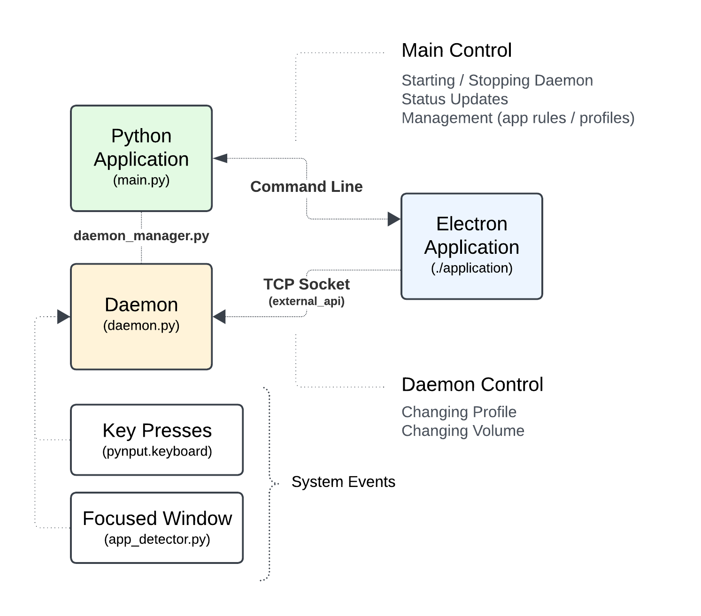

# Development

This section is intended for developers who wish to contribute to this project.

## Architecture



## Development Environment

Follow the steps below to set up your development environment and start contributing.

### Prerequisites

- [Git](https://git-scm.com/downloads)
- [Python](https://www.python.org/) (version 3.7 or higher)
- [pip](https://pip.pypa.io/en/stable/installing/) (Python package installer)
- [Node.js (npm)](https://nodejs.org/en/download/package-manager) (Node.js package installer)

### Cloning the Repository

Begin by cloning the repository to your local machine using Git:

```bash
git clone https://github.com/nathan-fiscaletti/keyboardsounds.git
```

Change to the project directory:

```bash
cd keyboardsounds
```

### Installing Dependencies

4. **Install Dependencies: Python**

   Install the project dependencies using `pip`:

   ```bash
   pip install -r requirements.txt
   ```

5. **Install Dependencies: Node.js**

    Install the project dependencies using `npm`:
  
    ```bash
    cd application
    npm install
    ```

### Running the Project Locally

It is recommended that you install the package in editable mode to allow you to make changes to the code and see the changes reflected in the application.

- To install the package in editable mode, use the following command:

  ```bash
  pip install -e .
  ```

  This command will install the package in editable mode, allowing you to make changes to the code and see the changes reflected in the application.

### Running the Desktop Application

To run the desktop application in development mode, run the following:

```bash
# Build the runtime (used by the desktop application)
powershell .\build-runtime.ps1

# Run the desktop application
cd application
npm run start
```

### Contributing

Contributions are what make the open-source community an amazing place to learn, inspire, and create. Any contributions you make are **greatly appreciated**.

#### Submitting Pull Requests

1. Fork the repository and create your branch from `master`.
2. If you've added code, ensure your code adheres to the project's coding conventions.
4. Update documentation as necessary.
5. Submit your pull request with a detailed description of your changes.

### Getting Help

Should you have any questions or encounter issues, feel free to open an issue on the repository, and I'll do my best to address it.