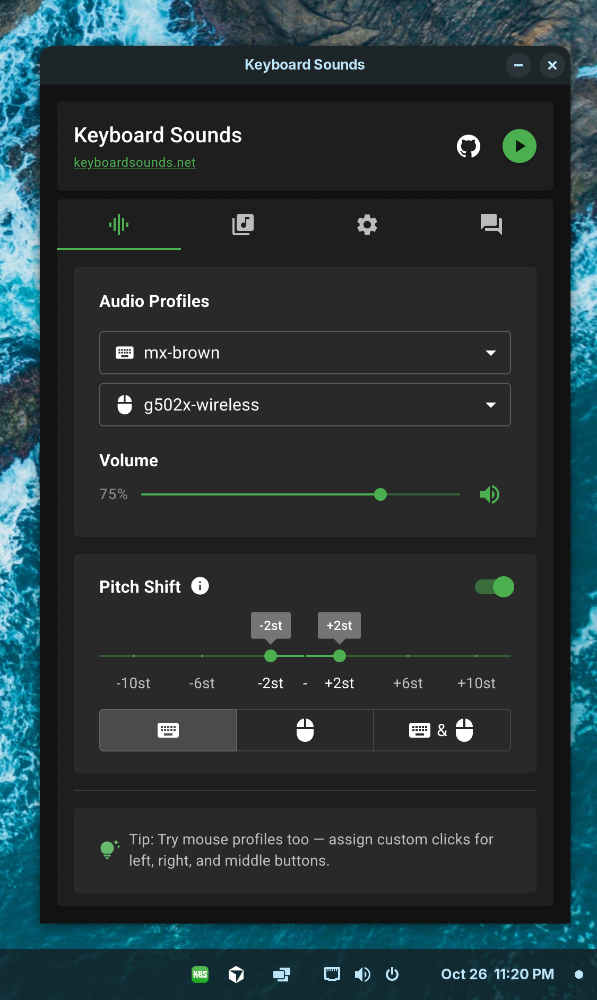

# Keyboard Sounds: Linux Support



## Command Line

The Keyboard Sounds **command line** application is supported on Linux through [`pip`](https://packaging.python.org/en/latest/tutorials/installing-packages/). 

```
pip install keyboardsounds
```

## Desktop Application

> [!WARNING]\
> The Linux distribution of the Keyboard Sounds Desktop Application is currently in beta.

[Download the latest release here](https://github.com/nathan-fiscaletti/keyboardsounds/releases/latest)

### Using with Wayland

On Wayland, the application will use the libevdev library to listen for keyboard and mouse events. This is necessary because Wayland does not support the X11 event model. 

> [!IMPORTANT] 
> In order for libevdev to work, your user must be added to the `input` group through `usermod`.

You can add your user to the `input` group by running the following command:
```bash
sudo usermod -aG input $USER
```
Then, log out and log back in for the changes to take effect.

Keyboard Sounds is not officially supported when running as root.

---

To expand support for other Linux distributions and window managers, I'm seeking volunteers to test the application in different environments. As I'm unable to personally test on all setups, your contributions would be invaluable to the project. If you are interested in helping, please [DM me on Discord](https://discord.gg/gysskqts6z).
